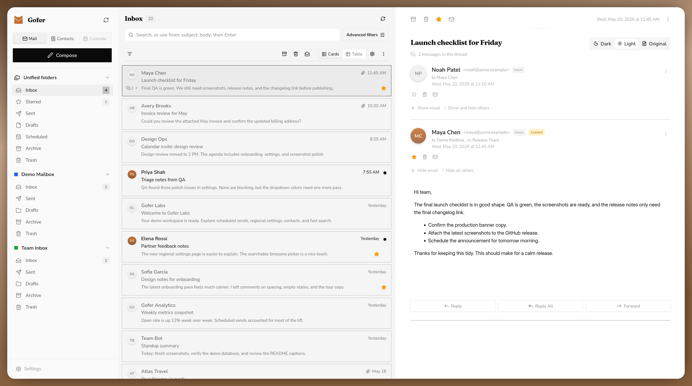
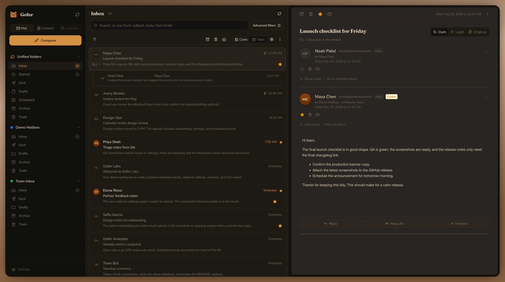

<h1>
  
  Gofer
</h1>

| Minimal light | Classic dark |
| --- | --- |
|  |  |

[View all screenshots](./screenshots/README.md)

<br>

Small local email client thing I am building for myself.

It is still a personal project, but it has slowly become a lot more usable. I am using it for my emails as a daily driver already.
Stuff is missing, some things are messy, and I am still figuring out the shape of it.

Right now it is a Go app with templ views, HTMX-ish interactions, SQLite storage, IMAP/SMTP support, Gmail OAuth, and some contact sync stuff. The idea is to have a fast local mail client that stores mail locally and talks directly to normal mail/contact providers.

A bunch of the UI bits are built with [templUI](https://templui.io). I recommend you to check it out.

## what works

This is the stuff that is implemented enough to use locally:

- adding generic IMAP/SMTP accounts
- connecting Gmail accounts with Google OAuth
- syncing mail into SQLite, with polling and optional IMAP IDLE per folder
- reading messages, threads, cached bodies, inline content, and attachments
- blocking remote content by default, then allowing it per message or sender
- sending mail over SMTP, including attachments and account signatures
- scheduled send, with scheduled messages shown as a virtual folder
- drafts and compose autosave
- folders, unread state, starred messages, archive, move, spam, trash, and delete actions
- quick search plus advanced filters for status, attachments, threads, labels, accounts, dates, people, subject, body, domains, and attachment names
- contacts, including manually saved contacts and observed contacts from mail
- contact import/export with vCard files
- Google Contacts sync through the People API
- CardDAV contact sync with discovery, multiple address books, pull, push, update, and delete paths
- account colors, account testing, account service toggles, and encrypted stored passwords/tokens
- local mode by default, with optional Google login/session auth when configured
- optional browser-tab notifications and Web Push notifications for new mail
- theme, layout, list navigation, compose, signature, contact, sync, timezone, and notification settings
- local cached blobs for message bodies, remote assets, and attachments

## planned / half done

Things I still want to improve or finish:

- labels/tags UI beyond filtering
- calendar support; the sidebar button is still disabled
- richer regional settings, probably language next
- better account setup, diagnostics, and reconnect flows
- better handling for edge-case IMAP servers
- more keyboard shortcuts
- more bulk actions and cleanup flows
- more tests around the scary parts
- general UI polish

There are tests now, but not enough to call this boring software yet. Do not run this on a public server.

## running it

You need Go, `templ`, `tailwindcss`, and `task` if you want to use the task commands.

For development with hot reload:

```sh
task dev
```

Or roughly:

```sh
templ generate
tailwindcss -i ./assets/css/input.css -o ./assets/css/output.css
go run .
```

Then open `http://localhost:8090`.

## building it

For a normal local build:

```sh
task build
```

That runs `templ generate`, builds the Tailwind CSS file, and writes the binary to:

```sh
./tmp/main
```

Then run it with whatever env vars you need:

```sh
GO_ENV=production ./tmp/main
```

This is not a polished release process. It is just the boring local binary I use when I do not want the dev watchers running.

## data

Runtime data lives in `data/` by default. That includes the SQLite DB, cached emails, attachments, and the local secret key used for encrypted account passwords.

That directory is ignored by git. Do not commit it.

Useful env vars:

```sh
GO_ENV=development
GOFER_DB_PATH=data/gofer.db
GOFER_SECRET_KEY=64_hex_chars_if_you_want_to_provide_your_own_key
GOFER_AUTH_ENABLED=false
GOFER_BASE_URL=http://local.localhost:8090
GOOGLE_OAUTH_CLIENT_ID=optional_for_google_login_gmail_contacts
GOOGLE_OAUTH_CLIENT_SECRET=optional_for_google_login_gmail_contacts
MICROSOFT_OAUTH_CLIENT_ID=optional_for_outlook_oauth_mail
MICROSOFT_OAUTH_CLIENT_SECRET=optional_for_outlook_oauth_mail
MICROSOFT_OAUTH_TENANT=common
GOFER_VAPID_PUBLIC_KEY=optional_web_push_public_key
GOFER_VAPID_PRIVATE_KEY=optional_web_push_private_key
GOFER_VAPID_SUBJECT=mailto:gofer@gofer.email
```

Google OAuth is only needed for Google login, Gmail OAuth accounts, and Google Contacts sync. Microsoft OAuth is only needed for Outlook mail and contact sync. Plain IMAP/SMTP accounts do not need it.

## warning

This is a personal WIP project, not a finished mail client. It has sharp edges and the security model is basically "run it locally and don't expose it".

If you try it anyway, expect weirdness.
