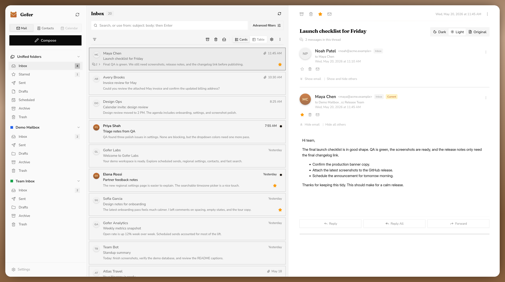
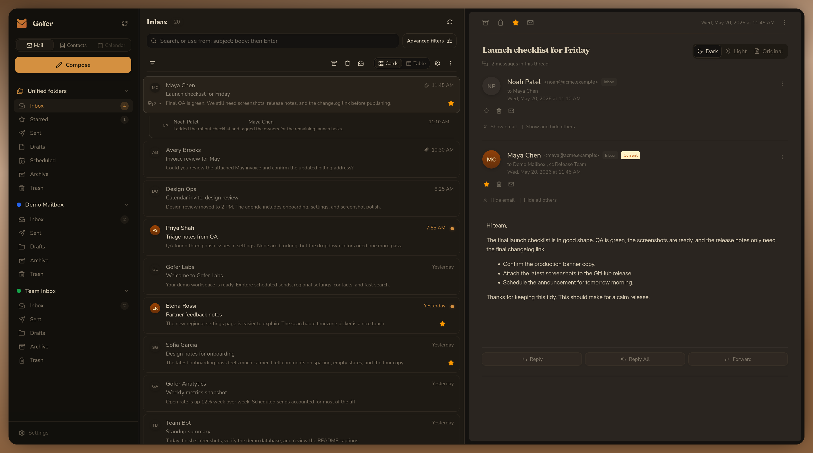

<h1>
  
  Gofer
</h1>

| Minimal light | Classic dark |
| --- | --- |
|  |  |

[View all screenshots](./screenshots/README.md)

<br>

Gofer is a local-first email client I work on as a side project. It's built with Go, templ views, HTMX-style interactions, and SQLite storage.

It is meant to run on your own machine, keep mail and related data local, and talk directly to mail and contact providers. Generic accounts use IMAP/SMTP. Gmail uses the Gmail API and Google People API. Outlook uses Microsoft Graph.

The project is in alpha, but it is already useful for real local mail. It started as a small mail thing and then, predictably, became a slightly larger mail thing. I'm keeping it light for now, so expect things to keep changing as the app settles.

Offering a more complete, multi-user, hosted version in the future is not off the table, it can be an interesting path

For reference, I'm using it actively with 6 configured accounts and about 100k emails in total. So far not a single performance issue or increased memory consumption

## features

Things that already work (well, they work on my machine):

- adding generic IMAP/SMTP accounts
- connecting Gmail accounts through Google OAuth, with mail handled by the Gmail API
- connecting Outlook accounts through Microsoft OAuth, with mail handled by Microsoft Graph
- syncing mail into SQLite, with provider-native sync for Gmail and Outlook and polling/optional IMAP IDLE for generic accounts
- reading messages, threads, cached bodies, inline content, and attachments
- blocking remote content by default, then allowing it per message or sender
- sending mail, including attachments and account signatures
- scheduled send, with scheduled messages shown as a virtual folder
- drafts and compose autosave
- folders, unread state, starred messages, archive, move, spam/not-spam, trash, and delete actions
- quick search plus advanced filters for status, attachments, threads, tags, accounts, dates, people, subject, body, domains, and attachment names
- contacts, including manually saved contacts and observed contacts from mail
- contact import/export with vCard files
- Google Contacts sync through the People API
- Outlook contact sync through Microsoft Graph
- CardDAV contact sync with discovery, multiple address books, pull, push, update, and delete paths
- the Contacts area, in general, aims to offer a "centralized" contacts solution, where you can use Gofer as a source of truth and syncronize with the accounts you want. Interesting idea, I'm not so sure about the execution. We'll see how it progress
- account colors, account testing, account service toggles, and encrypted stored passwords/tokens
- local mode by default, with optional Google login/session auth when configured (I recommend you not to use this for now, very very alpha stage)
- optional browser-tab notifications and Web Push notifications for new mail
- theme, layout, list navigation, compose, signature, contact, sync, timezone, and notification settings
- local cached blobs for message bodies, remote assets, and attachments
- Live translation using the Google Translate public API, for now
- I'm sure I'm forgetting a lot of stuff

## still moving

Things I'm still improving, in no especially noble order:

- smoother first-run setup and OAuth credential guidance
- proper, public implementation of the oauth integration, so you as end user don't need to create your own provider
- clearer diagnostics and reconnect flows
- broader test coverage around provider sync behavior
- deeper labels/tags workflows beyond filtering
- calendar support
- richer regional and language settings
- more keyboard shortcuts, bulk actions, and cleanup flows

Gofer is meant for local use. Please do not expose it directly on a public server. That's a different kind of adventure, meant for future chapters in this story

## running it

Downloaded release binaries include the generated web assets. For development from source, you need Go, `templ`, `tailwindcss`, and `task`.

For development with hot reload:

```sh
task dev
```

Or roughly:

```sh
templ generate
tailwindcss -i ./assets/css/input.css -o ./assets/css/output.css
go run .
```

Then open `http://local.localhost:8090`.

## building it

For a normal local development build:

```sh
task build
```

That runs `templ generate`, builds the Tailwind CSS file, and writes the binary to:

```sh
./tmp/main
```

Then run it with whatever env vars you need:

```sh
GO_ENV=production ./tmp/main
```

For a self-contained release binary with embedded assets:

```sh
task release
```

That writes:

```sh
./dist/gofer
```

For cross-platform release archives:

```sh
VERSION=v0.3.0-alpha.1 task release:all
```

That writes Linux, macOS, and Windows archives plus `dist/checksums.txt`.

## OAuth credentials

Generic IMAP/SMTP accounts do not need OAuth application credentials. Gmail and Outlook do.

For now, alpha builds expect you to provide your own OAuth client ID and client secret for Google and Microsoft. Create credentials in the provider console, configure callback URLs for your `GOFER_BASE_URL`, and keep the generated secrets private. For Google, enable the Gmail API and People API in the same project.

Official provider docs:

- [Google OAuth 2.0 for web server applications](https://developers.google.com/identity/protocols/oauth2/web-server)
- [Microsoft Entra app registration](https://learn.microsoft.com/en-us/entra/identity-platform/quickstart-register-app)

Default local callback URLs:

```text
http://local.localhost:8090/auth/google/account/callback
http://local.localhost:8090/auth/google/callback
http://local.localhost:8090/auth/microsoft/account/callback
```

The Google login callback is only needed if you enable Gofer's optional Google-backed app login (again please don't do this). Gmail account setup uses the Google account callback.

## configuration

Runtime data lives in `data/` by default. That includes the SQLite DB, cached emails, attachments, and the local secret key used for encrypted account passwords.

That directory is ignored by git. Do not commit it.

Useful env vars:

```sh
GO_ENV=development
GOFER_DB_PATH=data/gofer.db
GOFER_SECRET_KEY=64_hex_chars_if_you_want_to_provide_your_own_key
GOFER_SETUP_TOKEN=optional_first_run_secret_of_at_least_32_bytes
GOFER_ADDR=127.0.0.1:8090
GOFER_BASE_URL=http://local.localhost:8090
GOFER_ALLOW_UNAUTHENTICATED_REMOTE=false
GOFER_AUTH_ENABLED=false
GOOGLE_OAUTH_CLIENT_ID=optional_for_google_login_gmail_contacts
GOOGLE_OAUTH_CLIENT_SECRET=optional_for_google_login_gmail_contacts
MICROSOFT_OAUTH_CLIENT_ID=optional_for_outlook_oauth_mail
MICROSOFT_OAUTH_CLIENT_SECRET=optional_for_outlook_oauth_mail
MICROSOFT_OAUTH_TENANT=common
GOFER_VAPID_PUBLIC_KEY=optional_web_push_public_key
GOFER_VAPID_PRIVATE_KEY=optional_web_push_private_key
GOFER_VAPID_SUBJECT=mailto:gofer@gofer.email
```

Google OAuth is used for optional Google login, Gmail mail through the Gmail API, and Google Contacts sync through the People API. Microsoft OAuth is used for Outlook mail and contact sync through Microsoft Graph.

On the first startup of an authentication-uninitialized database, Gofer stores only the hash of a 30-minute setup token. If `GOFER_SETUP_TOKEN` is set, its exact value is used without being echoed and must contain 32-1024 bytes. Otherwise Gofer generates a 256-bit token and prints it once to the local console. A restart never reprints or silently replaces the persisted token.

Open `/setup` and paste the token into the password-masked form. Gofer never accepts the token from a URL, cookie, or browser storage. A successful submission exchanges it for a ten-minute, origin-bound server-side setup challenge represented by an `HttpOnly`, `SameSite` cookie; SQLite stores only the challenge hash. The setup token remains unconsumed until owner enrollment completes atomically. Ten rejected submissions block that token until local rotation, and incorrect, expired, or blocked tokens receive the same generic response. Setup routes return `404` after authentication initialization completes.

Behind that verified setup access, Gofer inspects existing application users before collecting the owner profile. A fresh database creates a new owner target; the exact legacy `default` placeholder is claimed in place so its mail and settings keep the same owner ID; other existing installations require an explicit user selection or a deliberate new-owner choice. Gofer refuses ambiguous or excessive candidate sets instead of inferring or merging an owner. The submitted display name, username, and email are normalized, checked across both login-identifier namespaces, and stored as an encrypted draft bound to the active setup challenge. Saving this draft does not create or update a user, assign a role, move data, consume the setup token, or initialize authentication.

The next protected step collects and confirms the owner's local password. Gofer applies the same local password policy used by account enrollment, hashes the accepted password immediately with Argon2id, and stores only that hash inside the encrypted, challenge-bound setup draft. The plaintext password is never redisplayed or persisted, and changing the owner profile discards the prepared password so it must be validated against the current identity. This step still does not create a user or credential, start a session, consume the setup token, or initialize authentication; those changes remain deferred until the owner has completed the required administrator security enrollment and confirms the final setup transaction.

After the password is ready, the owner explicitly starts authenticator enrollment. Gofer generates a 160-bit TOTP seed, renders its `otpauth://` QR code locally, and also presents a grouped manual setup key; no third-party QR service receives the seed. Enrollment uses the broadly compatible RFC 6238 profile of HMAC-SHA-1, six digits, and a 30-second period. Gofer requires a current authenticator code, accepts only the immediately previous or next time step for small clock differences, bounds consecutive failures with the active setup challenge, and records the exact accepted step to prevent replay when the credential is persisted. The seed and accepted step remain only in the encrypted setup draft until recovery codes are acknowledged and final enrollment commits atomically.

## local authentication operations

The binary includes authentication commands for local operators:

```sh
./gofer auth status
./gofer auth users list
```

These commands use `GOFER_DB_PATH` (default `data/gofer.db`) and open an existing, current-schema database without applying migrations. They do not load HTTP or provider configuration, generate runtime keys, bind a listener, or start synchronization and background workers. Output is limited to initialization state, non-secret setup-token metadata, and application-user identity/status metadata; credential and raw token material is never displayed. Because both commands are query-only, the Gofer server does not need to be stopped while they run.

If setup is unfinished and its token expired or was lost, stop Gofer and run:

```sh
./gofer auth setup-token rotate
```

Rotation requires Gofer's exclusive database lock, invalidates the previous setup token and any active browser setup challenge, resets its attempt count, records a redacted local-operator audit event, and prints one new 30-minute token. SQLite stores only its hash. Treat the output as a password and do not put it in a URL, shell history, logs, or chat. The command refuses to reopen an instance whose authentication setup is already complete.

If a user loses every usable application-login credential, first use `auth users list` to copy the exact user ID. Then stop the Gofer server and run:

```sh
./gofer auth recover --user '<user-id>' --confirm '<user-id>'
```

Recovery refuses to run unless both IDs match exactly and it can acquire Gofer's exclusive database lock. The command preserves an active or disabled user's status, immediately increments their authentication version, revokes all live sessions, replaces any unused credential-reset token, and commits a redacted local-operator audit event. It then prints one new 30-minute, single-use reset token. SQLite stores only the token hash.

Treat the printed token as a password: do not put it in a URL, shell history, logs, or chat. Restart Gofer, open `/account/redeem`, paste the token into the masked token field, and choose the new password. A disabled user remains disabled after resetting the password and must be enabled separately. If output is lost, stop Gofer and run recovery again; the replacement token invalidates the previous one.

For a lost browser, suspected session-cookie theft, or a precautionary global sign-out where the user's credential is still trusted, stop Gofer and run:

```sh
./gofer auth sessions revoke --user '<user-id>' --confirm '<user-id>'
```

Session revocation requires the same exact-ID confirmation and exclusive database lock as recovery. It signs the active or disabled target out everywhere and records a redacted local-operator audit event, but it does not change the user's password, reset tokens, authentication version, or account status. After Gofer restarts, an active user can sign in again with the same credential. Use `auth recover` instead if that credential may also be compromised.

## local security model

Gofer stores mail, cached blobs, account credentials, OAuth tokens, and runtime state locally. The practical security model is simple and very glamorous: run it on a trusted local machine, keep `data/` private, keep OAuth client secrets out of git, and avoid exposing the app directly to the public Internet.

The default HTTP listener is `127.0.0.1:8090`. Gofer refuses to start with authentication disabled when either the listener or canonical base URL is non-loopback. A trusted network or container setup can bypass that check with `GOFER_ALLOW_UNAUTHENTICATED_REMOTE=true`, but anyone who can reach the resulting service can control the application.

`GOFER_BASE_URL` is the canonical browser origin and OAuth callback origin. Unsafe browser requests and the event stream are accepted only from that origin (plus exact loopback aliases in local mode), and requests with an unexpected Host are rejected. For remote authenticated access, use an HTTPS base URL and terminate TLS at a reverse proxy that preserves the original Host header.

Non-browser automation that intentionally performs an unsafe request without browser Origin or Fetch Metadata headers must send `X-Gofer-Request: 1`. This header is a browser-CSRF signal, not an authentication mechanism.

## admin panel

There is also a small `/admin` area for operational bits I did not want to hide in logs forever. It currently has pages for avatar checks, contact sync/backfill status, and label/provider diagnostics, including Gmail API and Outlook Graph parity checks. It is mostly a local debugging cockpit, not a grand enterprise command center, but it is useful when sync feels suspicious.

## built with

Some of the main libraries and tools Gofer leans on, because pretending I wrote the whole mail stack from scratch would be absurd:

- [templ](https://templ.guide/) for Go-based views
- [templUI](https://templui.io/) for several UI components
- [HTMX](https://htmx.org/) for server-driven interactions
- [Tailwind CSS](https://tailwindcss.com/) for styling
- [modernc.org/sqlite](https://pkg.go.dev/modernc.org/sqlite) for SQLite storage
- [emersion](https://github.com/emersion)'s Go mail libraries, including [go-imap](https://github.com/emersion/go-imap), [go-smtp](https://github.com/emersion/go-smtp), [go-message](https://github.com/emersion/go-message), [go-sasl](https://github.com/emersion/go-sasl), and [go-vcard](https://github.com/emersion/go-vcard), which provide much of Gofer's mail, MIME, auth, and contact-format foundation
- [golang.org/x/oauth2](https://pkg.go.dev/golang.org/x/oauth2) for OAuth flows
- [webpush-go](https://github.com/SherClockHolmes/webpush-go) for Web Push notifications
- [Lucide](https://lucide.dev/) icons through templUI's icon component
