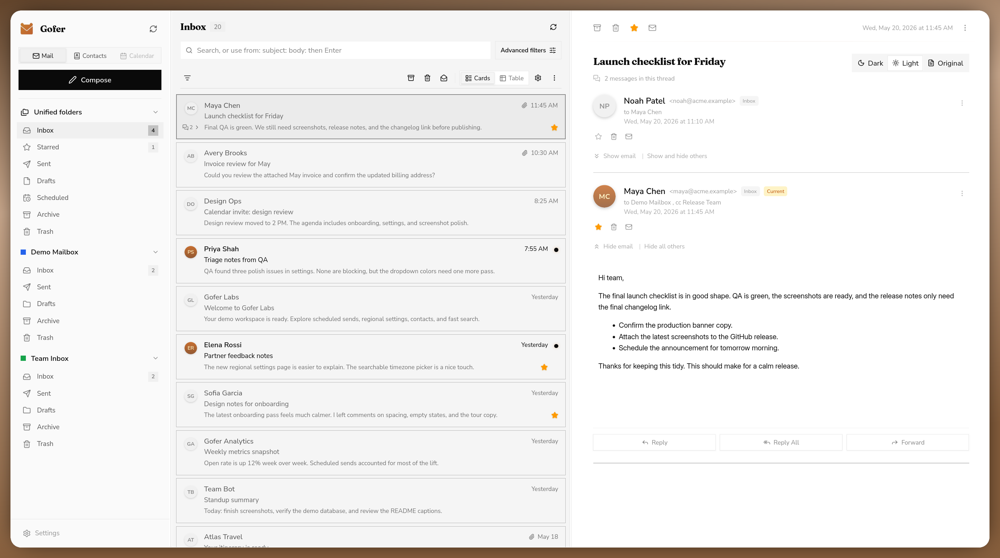
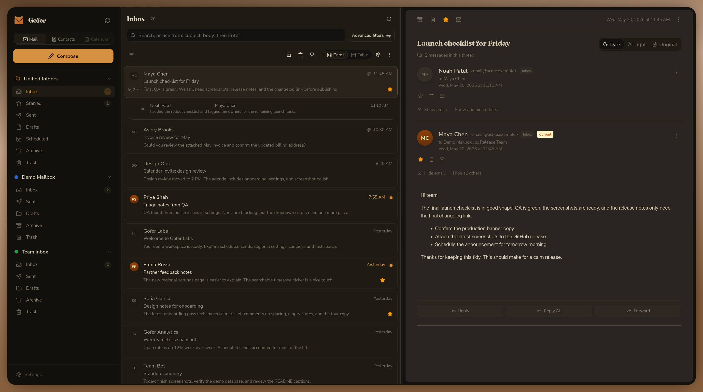

<h1>
  
  Gofer
</h1>

| Minimal light | Classic dark |
| --- | --- |
|  |  |

[View all screenshots](./screenshots/README.md)

<br>

Gofer is a self-hosted email, contacts, and calendar app I'm building. It started as a small mail thing and has grown to support personal use and shared installations with multiple users, separate administrators, invitations, and security policies.

You can run it on your own machine or a server and access it through a browser. Mail and related data are cached in SQLite wherever you host it. Gofer talks directly to your providers: IMAP/SMTP for generic mail accounts, Google APIs for Gmail, contacts, and calendars, Microsoft Graph for Outlook, and CardDAV/CalDAV for compatible contact and calendar services.

I'm still working on it, and it's pre-1.0, so expect things to keep changing as the app settles. Provider compatibility, setup, and upgrades still need care. Please read the limitations below and keep backups before upgrading.

For reference, I'm actively using it with six configured accounts and around 100k emails in total. So far, I haven't run into performance issues or increased memory consumption.

## features

What you can do with it today:

- **Users and access:** multiple users with separate administrators, invitations, and security policies; personal mode for one protected profile; and a no-login mode for local use.
- **Accounts and sync:** multiple IMAP/SMTP, Gmail, and Outlook accounts, with mail cached in the instance's SQLite database.
- **Reading and sending:** threads, attachments, drafts with autosave, signatures, scheduled send, and translation.
- **Organization and search:** folders, stars, archive, spam controls, and advanced search filters.
- **Contacts:** local address books, vCard import/export, Google, Outlook, and CardDAV sync, plus Gofer Sync for automatic contact syncing between accounts.
- **Calendar:** Google Calendar, Outlook, and CalDAV sync, month and week views, upcoming events, and event creation, editing, and deletion, including recurring series and individual occurrences.
- **Meetings:** guest invitations, RSVP from Calendar or Mail, rich event descriptions, and Google Meet or Microsoft Teams links where the provider supports them.
- **Security:** encrypted stored credentials, remote content blocked by default, password and external sign-in, and MFA with TOTP or passkeys.
- **Customization:** themes, layouts, account colors, regional settings, and browser/Web Push notifications.

## still moving

Things I'm still improving, in no particular order:

- smoother first-run setup and OAuth credential guidance
- shared OAuth applications so users do not need to register their own provider clients
- clearer diagnostics and reconnect flows
- broader test coverage around provider sync behavior
- deeper labels/tags workflows beyond filtering
- broader calendar provider compatibility and recurring meeting support
- richer regional and language settings
- more keyboard shortcuts, bulk actions, and cleanup flows

## running and building

Downloaded release binaries include the web assets. Development from source requires Go, `templ`, `tailwindcss`, and `task`.

```sh
task dev      # development server with hot reload
task build    # local build at ./tmp/main
task release  # self-contained binary at ./dist/gofer
```

With the development server running, open `http://local.localhost:8090`. See the [Taskfile](./Taskfile.yml) for packaging and other build tasks.

## setup and configuration

Choose `GOFER_AUTH_MODE=managed` for multiple users with separate administrator accounts, or `personal` for one protected profile with multiple mailboxes. Both modes guide you through first-run setup using a token printed in the terminal. The default `open` mode has no login and is intended for local use. See [`.env.example`](./.env.example) for configuration options.

Managed mode keeps each user's mail, contacts, Calendar and preferences in a separate SQLite database. Authentication and installation settings stay in the central database. New installations initialize this layout automatically.

For an existing managed installation, stop Gofer and back up its data and secrets first. From the same working directory, with the original configuration and encryption key, run:

```sh
./gofer storage migrate --db data/gofer.db --to data/gofer-users.db
```

Set `GOFER_DB_PATH=data/gofer-users.db` before restarting. The destination must be a new filename in the original data directory. Keep the original database, key and account files; also back up the new central database, its `.users` directory and `.layout.json` file together. Continue starting Gofer from the original working directory so retained file paths resolve correctly. If conversion is interrupted, repeat the command with `--retry`. Managed startup refuses incomplete layouts; personal/open mode keeps shared storage.

Generic IMAP/SMTP accounts need no OAuth application credentials. Gmail and Outlook currently require your own provider client ID and secret. Mailbox authorization and optional Google/Microsoft application sign-in use separate clients and callbacks.

> [!NOTE]
> I plan to add Gmail and Outlook connections that don't require you to provide your own OAuth app credentials. First, I need to research the right way to set up public OAuth applications and complete the providers' identity verification and any required app reviews. Until then, you'll need to use your own credentials as described above.

Configure Calendar under **Settings → Accounts**: enable it for an account, discover calendars, and select which ones to sync. Google and Outlook use the account's existing OAuth connection; reconnect older accounts to grant Calendar access if needed. Generic accounts can connect a CalDAV server using an HTTPS URL and server credentials, which may require an app password.

## deployment precautions

For server deployments, use personal or managed authentication, serve the application through an HTTPS reverse proxy, and configure `GOFER_ADDR` and `GOFER_BASE_URL` for your deployment. The listener binds to loopback by default. Set `GOFER_TRUSTED_PROXY_CIDRS` only for your actual proxy peers; use `GOFER_ALLOWED_CIDRS` when you need to restrict client networks.

Runtime data is stored in `data/` by default. Protect the data directory, configuration, and secrets, and back them up together before upgrades. Shared databases apply schema migrations at startup; conversion to managed per-user storage uses the offline command above. Going back to an older version may require restoring its matching backup, and the retained shared database does not include changes made after conversion. I recommend testing your providers and access setup before relying on Gofer for anything critical.

## current limitations

Calendar actions depend on provider permissions and capabilities:

- Creating or editing recurring meetings with guests or online meeting links is not supported yet.
- Existing Google Meet conferences cannot be removed in Gofer, Teams meetings cannot be disabled, and conference providers cannot be changed.
- CalDAV invitation delivery depends on the server's scheduling support or the account's mail-sending configuration.

## admin panel

In managed mode, `/admin` provides user administration, invitations, security policies, and security activity. It also includes diagnostics for account sync, contacts, avatars, and provider behavior.

## built with

Some of the main libraries and tools Gofer leans on, because pretending I wrote the whole mail stack from scratch would be absurd:

- [templ](https://templ.guide/) for Go-based views
- [templUI](https://templui.io/) for several UI components
- [HTMX](https://htmx.org/) for server-driven interactions
- [Tailwind CSS](https://tailwindcss.com/) for styling
- [modernc.org/sqlite](https://pkg.go.dev/modernc.org/sqlite) for SQLite storage
- [emersion](https://github.com/emersion)'s Go mail libraries, including [go-imap](https://github.com/emersion/go-imap), [go-smtp](https://github.com/emersion/go-smtp), [go-message](https://github.com/emersion/go-message), [go-sasl](https://github.com/emersion/go-sasl), and [go-vcard](https://github.com/emersion/go-vcard), which provide much of Gofer's mail, MIME, auth, and contact-format foundation
- [golang.org/x/oauth2](https://pkg.go.dev/golang.org/x/oauth2) for OAuth flows
- [webpush-go](https://github.com/SherClockHolmes/webpush-go) for Web Push notifications
- [Lucide](https://lucide.dev/) icons through templUI's icon component
